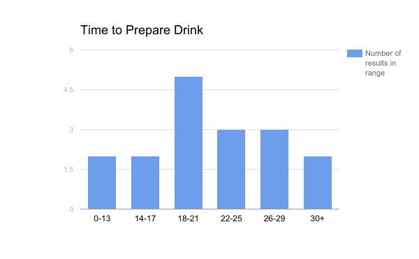

# Introduction
<!--
Describes the problem domain and the specific questions your team is tackling.
-->

For our project we chose to simulate Hemingway’s café, a bar and restaurant
located on Forbes Avenue. Per the usual with simulations we were interested in
matters of efficiency and optimality, in particular regarding the wait times
endured by customers and the idle time enjoyed by servers and bartenders.

Our first and second questions concern just how much idle time (defined as
time not spent interacting with customers or their immediate orders) servers
and bartenders have on average. This will be of interest to the managers of
the café for obvious reasons, as well as giving a rough idea how much time
the servers and bartenders have to devote to other tasks, such as cleaning or
organizing the café.

Our second and third questions regard the effect of the number of servers and
number of bartenders on customer wait time. There are three ways in which
customers can be forced to wait in the simulation — they can end up
waiting for a seat (which customers require an available server to acquire),
waiting for a drink order to be prepared by a bartender, or waiting for the
finished drink order to be delivered by a server. We expect that wait times
for seating are primarily a function of the number of servers and that wait
times for drinks are primarily a function of the number of bartenders, so
our questions are: how much do the numbers of those employees affect those
corresponding types of wait times?

# Approach
<!--
Describe your model; what kind of data were necessary to develop this model?
Have a detailed subsection that discusses data collection and input modeling
-->

Because we were principally interested with three types of entities, namely
customers, bartenders, and servers, they were the three most focused on in the
design of the simulation. The simulation comprises a bar with an arbitrary
number of seats, each treated equivalently. Customers enter the bar at a known
average rate, estimated to be about 20 per hour following an exponential
distribution. In reality, customers tended to arrive sporadically and with high
variance in both time and number, so we were forced to smooth this out somewhat
to get results that are more representative on average.

## Data Collection

The particular bar we modeled has a fixed number of seats, servers, and
bartenders, so we were able to collect data from there to parameterize our
simulation. We did this by sitting at the bar and observing as people came and
went, marking down the times when drink orders were placed, when they were
completed by the bartender, and when the server would deliver the completed
order to the customer. The ticket printer behind the counter proved invaluable
for this task, since we could rely on the sound it produced as a signal for
when an order was placed. The bartender would then prepare the drink and place
it on top of the corresponding ticket, which we used as the signal for the end
of the drink’s preparation. Eventually a server would take the finished drink
and deliver it to a table or seat. We performed these observations over the
course of several days over the same two-hour Happy Hour periods each day, from
4 to 6 PM. We then collated our data to get average parameters over the course
of the days we observed.

## Input Modeling

Once customers arrive at the bar, they enter a seating queue, in which they
remain until a server and a seat are available. Once so, the server seats
the customer at the bar (taking on average 30 seconds to do so, distributed
exponentially), and the customer will then place the first of some number of
orders; on average customers want two drinks, distributed normally with a
standard deviation of one. (In other words, roughly 16% of customers order
one drink; 34% order two drinks; 34% order three drinks; and 16% order more
than three drinks). Customers “make up their minds” as to how many drinks
they want upon entering the bar, then order and consume that number of drinks
(ordering one, drinking it, ordering another, etc.) and leave promptly
afterward.

Servers and bartenders look around every thirty seconds to see if there are
any customers in need of service; if there are none, they idle around for
another thirty seconds before looking again (or do some other task, which is
considered idling in our data). This is realistic because people are rarely
truly “idle” — instead they occupy themselves with other tasks, some
work-related (such as cleaning tables, glasses, or the floor), and some not
work-related (such as checking one’s phone or watching the football game on
one of the televisions). An employer will want to minimize the latter form of
idling while preserving the former, but crucially an employer would not want
to eliminate all idling as we have defined it, since some is necessary to the
operation of the café.

The time it takes for a server to deliver a finished drink to a customer
is distributed normally with an average time of 50 seconds and a standard
deviation of 25 seconds. We obtained this distribution and its parameters
by putting the data into a histogram, estimating that it is approximately
normal, and calculated the corresponding maximum likelihood estimates for the
parameters of a normal distribution.

The time it takes for a bartender to prepare a drink is distributed normally
with an average time of 20.1717 seconds and a standard deviation of 7.3048
seconds. This was taken from the collected data by computing the mean of all
the data points, then taking the square root of the average of each data point
minus the mean squared to calculate the standard deviation. The histogram for
the data is shown below.

# Experiment
<!--
Describe how you set up the experiment to answer the questions you are trying
to solve; present the results and perform analysis.
-->

## Employee Idle Time

For our questions regarding server and bartender idle time, we simulated one
hundred days for each of the nine configurations of one, two, or three servers
or bartenders. The results are shown in \autoref{tab:server_idle_time} and
\autoref{tab:bartender_idle_time}.

\begin{table}[htpb]
\centering
\caption{Server idle time in seconds by number of servers and bartenders}
\label{tab:server_idle_time}
\begin{tabular}{ccccc}
\multicolumn{2}{c}{\multirow{2}{*}{}}                       & \multicolumn{3}{c}{Number of Bartenders}                  \\
\multicolumn{2}{c}{}                                        & 1                 & 2                 & 3                 \\ \cline{3-5}
\multirow{3}{*}{Number of Servers} & \multicolumn{1}{c|}{1} & 2,293.03 (31.85\%) & 2,327.88 (32.33\%) & 2,234.24 (31.03\%) \\
                                   & \multicolumn{1}{c|}{2} & 4,718.18 (65.53\%) & 4,666.52 (64.81\%) & 4,657.58 (64.69\%) \\
                                   & \multicolumn{1}{c|}{3} & 5,546.97 (77.04\%) & 5,555.66 (77.16\%) & 5,503.64 (76.44\%)
\end{tabular}
\end{table}

\begin{table}[htpb]
\centering
\caption{Bartender idle time in seconds by number of servers and bartenders}
\label{tab:bartender_idle_time}
\begin{tabular}{ccccc}
\multicolumn{2}{c}{\multirow{2}{*}{}}                       & \multicolumn{3}{c}{Number of Bartenders}                     \\
\multicolumn{2}{c}{}                                        & 1                  & 2                  & 3                  \\ \cline{3-5}
\multirow{3}{*}{Number of Servers} & \multicolumn{1}{c|}{1} & 5,683.03 (78.93\%) & 6,449.55 (89.58\%) & 6,700.30 (93.06\%) \\
                                   & \multicolumn{1}{c|}{2} & 5,684.55 (78.95\%) & 6,432.88 (89.35\%) & 6,687.68 (92.88\%) \\
                                   & \multicolumn{1}{c|}{3} & 5,685.15 (78.96\%) & 6,443.79 (89.50\%) & 6,689.80 (92.91\%)
\end{tabular}
\end{table}

Simply by observing the tables it is apparent that the number of bartenders
has a negligible effect on the idle time of servers and vice versa. This is
counterintuitive in that one would expect a more effective server staff would
mean bartenders would also have more customers to attend to and thus less idle
time, or that more bartenders would mean customers would be in and out faster
and thus there would be more opportunities for servers to be seating customers.
However, the other parameters of the simulation, such as customer arrival time,
drink preparation time, and the number of available seats dominate here; and
the large amount of idle time both types of employee have in even the sparsest
scenario (one server, one bartender) indicates that the system rarely becomes
congested enough for an increase in the efficiency of one area to "spill over"
into extra work in the other area.

## Seating Wait Time

In our measurements we grouped together drink preparation and delivery time,
and measured seating wait time separately.

To compute average wait times, we took the average wait time for all customers
over each day, and then computed a weighted average (using the number of
customers in a day as the weight) of those daily averages across one hundred
days for each configuration of the simulation. As before, we tried each of the
nine combinations of one, two, and three servers and bartenders.

The customer wait times to obtain seating as a function of the number of
servers and bartenders is shown in \autoref{tab:seating_wait_time}. One can see
that there is an insignificant difference in seating wait times based on the
number of bartenders, but that having two servers is a significant improvement
over having just one.

\begin{table}[htpb]
\centering
\begin{tabular}{ccccc}
\multicolumn{2}{c}{\multirow{2}{*}{}}                       & \multicolumn{3}{c}{Number of Bartenders} \\
\multicolumn{2}{c}{}                                        & 1            & 2           & 3           \\ \cline{3-5}
\multirow{3}{*}{Number of Servers} & \multicolumn{1}{c|}{1} & 117.58       & 114.40      & 113.24      \\
                                   & \multicolumn{1}{c|}{2} & 47.21        & 46.55       & 46.97       \\
                                   & \multicolumn{1}{c|}{3} & 40.68        & 39.49       & 40.12
\end{tabular}
\caption{Customer wait times for seating in seconds by number of servers and bartenders}
\label{tab:seating_wait_time}
\end{table}

Testing these is rather difficult, since we only have daily averages and
standard deviations. We were able to compute the overall average by using
a weighted average, but overall standard deviation is trickier. Since the
standard deviation for day $i$ is $s_i = \sqrt{\frac{\sum(x_i - \bar{x})^2}{N
- 1}}$, we computed the overall sample standard deviation (over one hundred
days) as $$s = \sqrt{\frac{\sum\left(s_i^2 \times (N_i - 1)\right)} {\left(\sum
N_i\right)-1}}.$$

Using the weighted average and average standard deviation, we can apply
hypothesis testing to confirm our suspicions. Looking only at scenarios with
one bartender, we get the statistics shown in \autoref{tab:seating_time_stats}.
Applying a two-sample $t$-test at the 95% confidence level shows that waiting
times do indeed go down between one server and two servers ($p \approx
0.0000$), but that having three servers does not significantly improve seating
wait times ($p \approx 0.0860$).

\begin{table}[htpb]
\centering
\caption{Seating time statistics}
\label{tab:seating_time_stats}
\begin{tabular}{lll}
Number of Servers      & Average seating wait time     & Std. dev. seating wait time \\ \hline
\multicolumn{1}{l|}{1} & \multicolumn{1}{l|}{117.5795} & 106.1657                    \\
\multicolumn{1}{l|}{2} & \multicolumn{1}{l|}{47.2096}  & 35.4633                     \\
\multicolumn{1}{l|}{3} & \multicolumn{1}{l|}{40.6848}  & 31.7374
\end{tabular}
\end{table}

## Drink Wait Time

Since it is quite clear from the results shown in \autoref{tab:drink_wait_time}
that our earlier assumption about the number of bartenders being the primary
influence on drink wait time is inaccurate, we will instead see how the number
of servers affects drink wait times.

\begin{table}[htpb]
\centering
\caption{Customer wait times for drinks in seconds by number of servers and bartenders}
\label{tab:drink_wait_time}
\begin{tabular}{ccccc}
\multicolumn{2}{c}{\multirow{2}{*}{}}                       & \multicolumn{3}{c}{Number of Bartenders} \\
\multicolumn{2}{c}{}                                        & 1            & 2           & 3           \\ \cline{3-5}
\multirow{3}{*}{Number of Servers} & \multicolumn{1}{c|}{1} & 178.72       & 167.41      & 165.42      \\
                                   & \multicolumn{1}{c|}{2} & 103.16       & 96.78       & 94.65       \\
                                   & \multicolumn{1}{c|}{3} & 96.50        & 89.44       & 87.02
\end{tabular}
\end{table}

We use the same process described in [Seating Wait Time][] to calculate the
relevant statistics, shown in \autoref{tab:drink_wait_time_stats}. Performing
more paired $t$-tests shows that there is a significant decrease in waiting
time for drinks when there are two servers instead of one ($p \approx 0.0000$),
but that the decrease in wait time when a third server is added is not
significant ($p \approx 0.0647$).

\begin{table}[htpb]
\centering
\caption{Drink wait time statistics}
\label{tab:drink_wait_time_stats}
\begin{tabular}{lll}
Number of Servers      & Average drink wait time       & Std. dev. drink wait time \\ \hline
\multicolumn{1}{l|}{1} & \multicolumn{1}{l|}{178.7223} & 92.2016                   \\
\multicolumn{1}{l|}{2} & \multicolumn{1}{l|}{103.1641} & 32.8311                   \\
\multicolumn{1}{l|}{3} & \multicolumn{1}{l|}{96.5016}  & 28.9030
\end{tabular}
\end{table}

# Conclusion
<!-- Lessons learned. -->

In order to minimize wait time for drinks, the café should consider having
three servers on staff. The number of bartenders is largely irrelevant,
provided there is at least one. To minimize seating time, the café should
have at least two servers, but adding a third does not offer a significant
advantage. Likewise, having two servers helps to minimize drink wait time, but
the advantage of adding a third is insignificant.

Having three servers on staff results in servers being idle upwards of 75%
of the time; having two results in around 65% idle time, and having only one
results in only about 32% idle time. The café should balance its decision
regarding how many servers to employ based on what percentage of their time the
servers should be spending doing tasks not directly related to interacting with
customers.

Having three bartenders on staff results in them being idle upwards of 92% of
the time; having two results in around 90% idle time; having one results in
about 79% idle time. The café likely does not need more than one bartender.

The large amount of idle time enjoyed by servers and bartenders indicates that
the café should focus on increasing the customer arrival rate, perhaps by
putting out advertisements.
